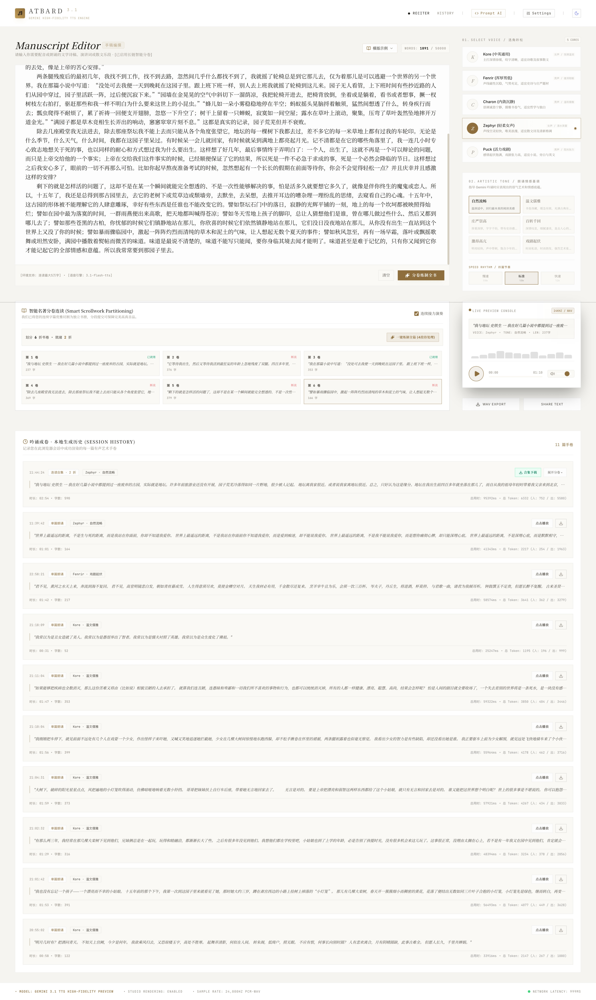

# ATBard (Gemini High-Fidelity TTS Engine)

ATBard 是一个基于 Google Gemini 3.1 Flash TTS 技术构建的高保真文学朗诵与有声书配音平台。它集成了创新的指令工程（Prompt Engineering）、长文本智能切片连读渲染、高颜双色自适应主题、本地播放可视化以及精细化的会话历史管理器。

# Demo

* 世界上最遥远的距离

https://github.com/user-attachments/assets/96493bb7-42ba-448a-9dd4-8f0626460777

* 将进酒

https://github.com/user-attachments/assets/3f81733a-1eae-4c79-b7ef-decb4adf5ce4

* 我与地坛

https://github.com/user-attachments/assets/b4f0ee96-5a1a-4b84-b886-813bfc7dcb16


* 系统界面

<div align="center">
  
</div>

---

## 核心特性

- **双色自适应艺术主题 (Dual Theme Modes)**:
  - **深色模式 (Dark Mode)**: 优雅的暗金色调设计，带给用户沉浸式的专业录音棚质感。
  - **浅色模式 (Light Mode)**: 温暖柔和的宣纸墨香色调，带来典雅清新的数字阅读体验。
  - 支持主题在导航栏一键切换，并自动通过 `localStorage` 记忆持久化。
- **Gemini 高保真 TTS 驱动 (Gemini 3.1 Flash TTS)**:
  - 支持调用 Google 官方最新的 `gemini-3.1-flash-tts` 毫秒级极速高质量语音合成引擎。
  - 提供 **API 配置管理面板 (API Settings)**，允许用户在界面上切换官方 Gemini 渠道与自定义 NewAPI 渠道参数（OpenAI 格式基础 URL），以适应不同的网络部署环境。
  - **Prompt 透视镜 (Prompt Inspector)**：内置指令工程视图，可随时查看并分析注入 Gemini API 的系统级情绪渲染指令。
- **整屏自适应艺术布局与高对比度微调 (Screen-Fitting Layout)**:
  - **整屏对齐**：在桌面端/1080P分辨率下，通过 CSS 弹性布局（Flexbox）及 `xl:min-h-0` / `xl:overflow-hidden` 约束，各面板会自动撑满且对齐整个页面高度，消除不必要的全屏滚动条。
  - **独立控制区滚动**：编辑器输入框容器为 `flex-1 min-h-[220px]`，可根据屏幕高度自动向下撑开；右侧配置栏支持独立分栏滚动，带来极佳的工具型系统质感。
  - **LIVE PREVIEW CONSOLE 移位**：播放控制台从右侧侧边栏移至中间 Manuscript Editor 下方，与全新的“导出音频”按钮右下对齐，整体紧凑合理。
  - **高对比度文案优化**：全面调优了界面上小字号、轻提示文字（如角色类型标签 `"女声 / 清水芙蓉"` 调整为带有金黄色背景与边框的精致徽章、角色描述及底栏等统一采用 `text-text-secondary` ），大幅提升在各种光线下的可读性。
- **多选角吟诵 (Voice Casting)**:
  - 提供 5 种不同音色与背景特征的专业声线，包括经典吟诵、叙事讲古、文艺散文等，完美契合不同文体的表现需求。
- **智能名著分卷连读 (Smart Partitioning & Merge)**:
  - 支持连读最大 5 万字的超级长文本手稿。
  - 自动对长篇手稿进行逻辑分段与多线程/顺序分卷合成。
  - 提供分卷进度管理、接力自动连播以及前端一键分卷合并下载（自动打包生成单轨完整 WAV）。
- **豪华播放控制台 (Visualizer Playback Console)**:
  - 内置动态音频频谱动画柱（跟随播放状态实时脉动）。
  - 支持音频进度拖拽拉伸、音量无级调整与一键静音。
  - 支持生成音频（WAV 格式，24,000Hz PCM 单声道）的无损本地导出（"导出音频" 按钮采用同 "唤醒朗诵大师" 相同的高级黄金色样式，放置于控制台右下方）。
- **深度增强的生成历史管理 (Enhanced History Manager)**:
  - **重新载入 (Reload)**：每个历史记录卡片提供“重新载入”功能，点击即可将当时生成的文本、参数（声线、风格、语速）重新载入主工作区，随时编辑或再次运行。
  - **模糊检索 (Search)**：支持在历史页直接搜索手稿关键字、配音角色、风格标签。
  - **细粒度删除 (Delete)**：支持物理删除指定的历史记录。如果是长文分卷，点击删除会自动把数据库中属于该 session 的所有音轨分卷全部级联清除。
  - **双日期筛选 (Filter)**：允许用户通过起止日期范围快速筛选该时间段内的生成记录。
  - **全部打包导出 (Export ZIP)**：支持一键将数据库中的全部音频文件打包下载为一个 ZIP 文件。分卷内容会自动规整到独立子文件夹下，并随包附赠一份结构整齐的 `manifest.txt` 文件描述每段音频对应的生成元数据和手稿，方便存录。

---

## 技术架构

ATBard 采用前后端分离但整合部署的架构设计：

- **前端 (Frontend)**:
  - 基于 React + TypeScript 构筑核心 UI。
  - 采用 **Vite** 作为开发与生产资源打包工具。
  - 引入 **Tailwind CSS v4** 作为基础样式引擎，利用 HSL 颜色变量绑定实现高性能的主题切换过渡。
- **后端 (Backend)**:
  - 基于 Python **Django** 框架处理 API 服务。
  - 使用 SQLite3 作为持久化数据库保存 API 配置项及状态。
  - 利用最新的 **Google GenAI Python SDK** (`google-genai`) 保持与 Gemini API 交互 the 稳定高效。

---

## 开发与部署指南

### 1. 环境准备

本应用依赖 `conda` 或系统级 `Python 3.10+` 和 `Node.js 18+` 开发环境。

```bash
# 激活推荐的 Python 运行环境
export PATH=/usr/local/bin:$PATH
conda create -n ATBard python==3.12
conda activate ATBard
```

### 2. 依赖安装

**前端依赖安装**:
```bash
npm install
```

**后端依赖安装**:
确保您已经安装了 Django 和 Google GenAI 库以及打包导出工具：
```bash
pip install -r requirements.txt
```

### 3. 环境配置 (`.env`)

在项目根目录下创建 `.env` 配置文件（可参考 `.env.example`）：

```ini
# Gemini 核心 API 秘钥配置
GEMINI_API_KEY="您的_GEMINI_API_KEY"

# 应用托管 URL (可选)
APP_URL="http://127.0.0.1:3000"
```

### 4. 数据库迁移

运行 Django 数据库迁移以初始化配置表和本地存储表：

```bash
python manage.py migrate
```

### 5. 编译前端资源

在开发或启动后端之前，必须先将 Vite 前端静态资产编译打包：

```bash
# 运行前端打包，生成 dist/ 静态目录
npm run build

# 运行 TypeScript 类型静态检查 (可选)
npm run lint
```

### 6. 运行应用

通过 Django 服务端直接运行整个项目。它会自动托管 Vite 打包好的前端静态资源并代理 API 请求：

```bash
# 启动本地开发/运行服务器，端口默认 3000
python manage.py runserver 0.0.0.0:3000
```

启动完成后，请在浏览器中访问 [http://localhost:3000](http://localhost:3000)。

### 7. Docker 容器化部署 (推荐)

如果您希望以纯净、快速、零依赖的方式部署应用，可以使用 Docker。

**方式 A：使用 Docker Compose (一键部署，自动持久化)**

1. 在宿主机配置您的环境变量（或在启动时传入）：
   ```bash
   export GEMINI_API_KEY="您的_GEMINI_API_KEY"
   ```
2. 运行一键构建并启动服务：
   ```bash
   docker compose up -d --build
   ```
   *服务会自动在后台构建，且启动后在宿主机自动生成 `./data` 文件夹映射至容器的 `/app/var` 目录，持久化保存 SQLite 数据库、日志与任务音频文件。*

**方式 B：使用原生 Docker 构建与运行**

1. 构建镜像：
   ```bash
   docker build -t atbard:latest .
   ```
2. 启动容器（映射宿主机 3000 端口，并挂载数据卷保持数据持久化）：
   ```bash
   docker run -d \
     -p 3000:3000 \
     -e GEMINI_API_KEY="您的_GEMINI_API_KEY" \
     -v $

https://github.com/user-attachments/assets/c4a32a5a-79d5-4948-83c6-2f5bfbf38031

(pwd)/data:/app/var \
     --name atbard-app \
     atbard:latest
   ```

启动成功后，即可直接在浏览器中访问 [http://localhost:3000](http://localhost:3000)。

---

## 核心 API 路由说明

后端对外暴露以下主要的接口路由：

- `GET    /api/health`: 检查系统全局 Gemini API Key 是否已配置。
- `POST   /api/recite`: 接受文本、音色、基调及语速设置，并调用 Gemini 接口生成 base64 PCM 音频流，最终在后端自动转换为 WAV 结构。
- `GET    /api/history`: 获取本地生成的历史记录。
- `DELETE /api/history`: 根据提供的 `id` 或 `session_id` 从本地 SQLite 中物理删除对应的音频记录。
- `GET    /api/history/export`: 将数据库中的所有生成历史转换为 WAV 音频，随同 `manifest.txt` 打包下载为 `.zip` 格式归档。
- `POST   /api/settings`: 保存与加载自定义 API 设置（包含官方 key、NewAPI base URL 与自定义模型标识）。

---

## 开发人员注意事项

- **主题系统扩展**:
  - 主题配置写 in [src/index.css](file:///opt/aitobox/ATBard/src/index.css) 中。若要为浅色或深色主题增加更多的语义化色值，可以直接在 `.light` 或 `:root` 下添加新的 CSS 自定义属性（Variables），并在顶部的 `@theme` 段中注册。
- **文件下载命名规则**:
  - 系统生成并在本地分卷合并导出的 WAV 音频，均遵循 `ATBard_[Date/Parameters].wav` 的规范格式进行命名。历史页全局 zip 导出下的录音根据模块特性分别存储在 `standalone/` 或 `session_[Id]/` 文件夹中。
